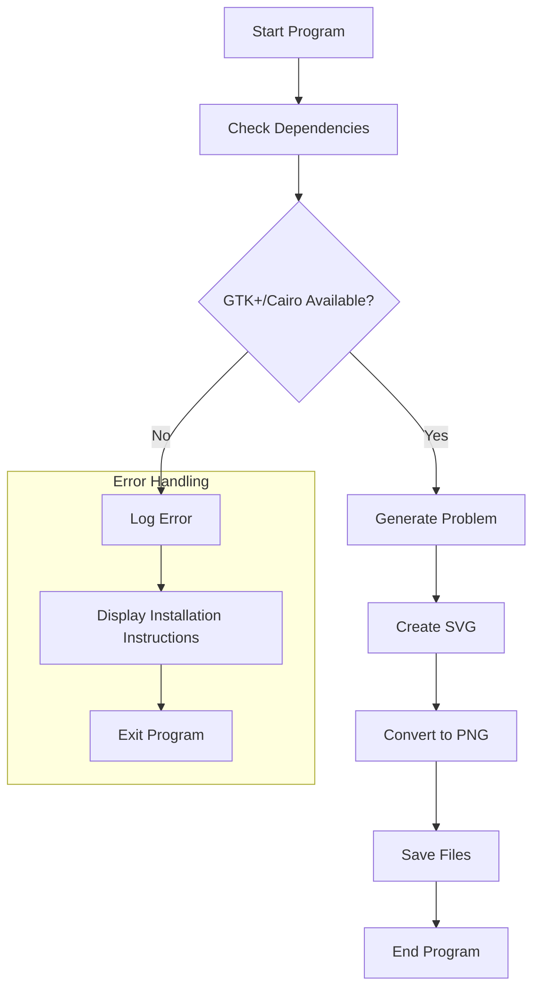

# repo
https://github.com/pleabargain/percentage-demo

# why
I saw this video and it rocked my basic understanding of math! 
https://www.youtube.com/shorts/VLOou59juGo

# Percentage Relationship Visualizer

An interactive Python tool that demonstrates the mathematical principle where "a% of b equals b% of a". The tool generates visual representations in both SVG and PNG formats, with an interactive command-line interface.

## Features

- Interactive command-line interface with colored output
- Handles both integer and floating-point calculations
- Generates SVG and PNG visualizations
- Supports random problem generation
- Detailed mathematical principle explanations
- Comprehensive error logging
- Cross-platform compatibility

## Installation

### 1. Clone the Repository
```bash
git clone [repository-url]
cd percentage-visualizer
```

### 2. Install Python Dependencies
```bash
pip install -r requirements.txt
```

### 3. System Dependencies

#### Windows
1. Download and install the GTK+ Runtime Environment:
   - Visit [GTK+ for Windows](https://github.com/tschoonj/GTK-for-Windows-Runtime-Environment-Installer/releases)
   - Download the latest `gtk3-runtime-x.x.x-x-x-x-x.exe`
   - Run the installer
   - Restart your computer after installation

#### Linux
```bash
sudo apt-get update
sudo apt-get install libcairo2-dev
```

#### macOS
```bash
brew install cairo
```

## Usage

1. Run the script:
```bash
python main.py
```

2. Follow the on-screen instructions:
   - Enter calculations in the format: `25% of 40`
   - Use decimals for precise calculations: `3.5% of 200`
   - Press Enter for random problems
   - Type `EXIT` to quit

## Example Outputs

## Program Flow



## Output Examples

The script generates two types of files for each problem:
1. SVG file (vector format)
2. PNG file (raster format)

Example filename: `75percent_of_25.svg`

The visualization includes:
- Title
- Problem statement
- Equivalent relationship
- General formula
- Calculated result

## Error Logging

All operations are logged to `error.log` with timestamps:
- Information about generated problems
- Successful file creation
- Any errors that occur during execution
- System dependency issues

## Common Issues

1. **"No library called 'cairo' was found"**
   - Windows: Install GTK+ Runtime
   - Linux: Install libcairo2
   - macOS: Install cairo via Homebrew

2. **PNG conversion fails but SVG works**
   - Verify system dependencies installation
   - Check error.log for specific error messages
   - Ensure proper permissions in output directory

## Contributing

Feel free to submit issues and enhancement requests!

## License

[Your chosen license here]

## Functions

- `generate_percentage_problem()`: Creates random number pairs
- `render_math_as_svg()`: Creates the visual representation
- `generate_multiple_problems()`: Batch generates multiple problems
- `generate_filename()`: Creates problem-based filenames

## Mathematical Relationship

The script demonstrates the mathematical principle that: 